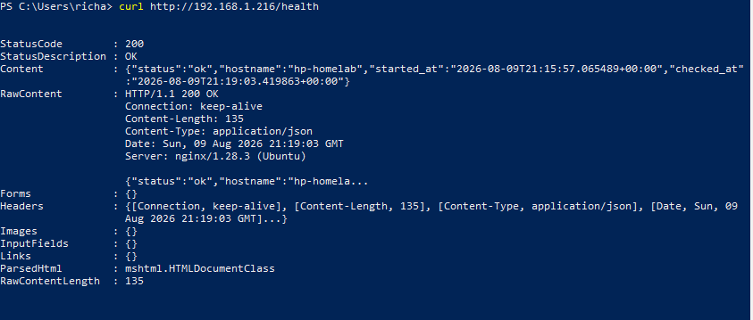
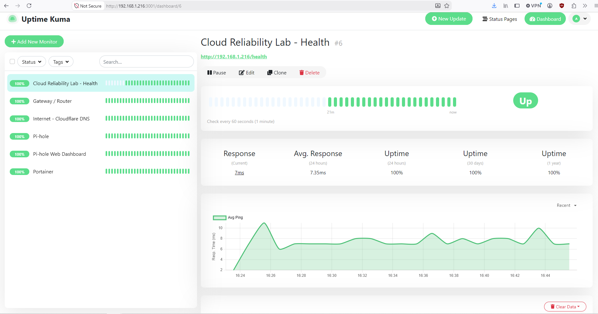
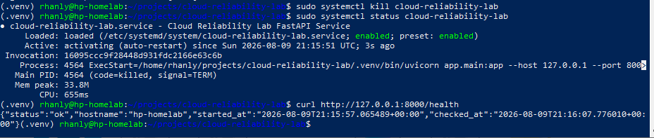
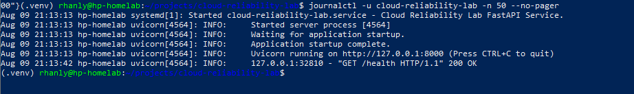
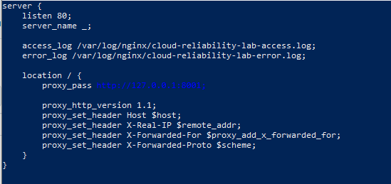
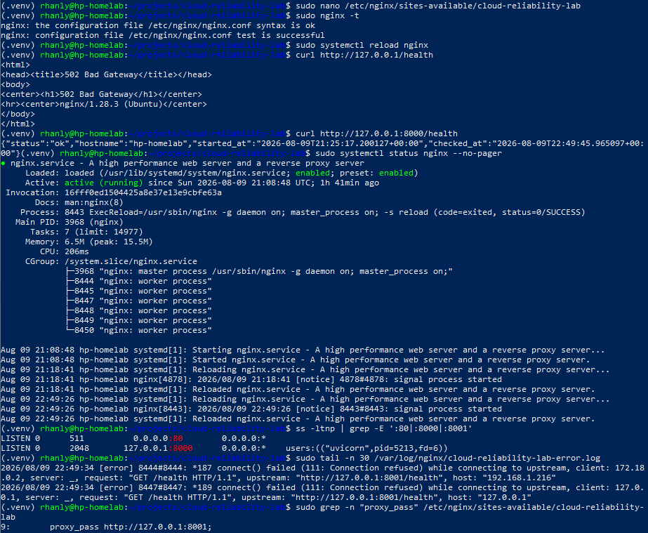

# Cloud Reliability Lab

Production-style Linux reliability lab built to practice systems administration, service monitoring, incident response, and SRE-style operations.

This project starts as a local homelab deployment and is designed to later expand into an AWS-based cloud reliability environment using EC2, CloudWatch, IAM, and Terraform.

## Overview

The Cloud Reliability Lab is a hands-on operations project that demonstrates how a small web service can be deployed, monitored, broken intentionally, recovered, and documented.

The current version runs on an Ubuntu homelab server and includes:

* FastAPI application
* systemd service management
* nginx reverse proxy
* health check endpoint
* journald logging
* nginx access/error logs
* automated service recovery
* Uptime Kuma monitoring
* operational runbooks
* incident reports
* validation screenshots
* documented nginx and systemd configuration files

The purpose of the project is not just to deploy an application. The goal is to practice the operational work involved in keeping services reliable.

## Current Architecture

```text
Windows Client / Browser
        |
        v
nginx reverse proxy
Port 80
        |
        v
FastAPI / Uvicorn
127.0.0.1:8000
        |
        v
systemd service
cloud-reliability-lab.service
        |
        v
Ubuntu homelab server
hp-homelab
        |
        v
Uptime Kuma monitoring
/health endpoint
```

## Technology Stack

| Component     | Purpose                                    |
| ------------- | ------------------------------------------ |
| Ubuntu Server | Linux host environment                     |
| FastAPI       | Python web application framework           |
| Uvicorn       | ASGI application server                    |
| systemd       | Service management and automatic restart   |
| nginx         | Reverse proxy                              |
| journald      | Service logging                            |
| nginx logs    | HTTP access and error logging              |
| Uptime Kuma   | Health check monitoring                    |
| Git           | Version control and documentation tracking |

## Application Endpoints

| Endpoint   | Purpose                      |
| ---------- | ---------------------------- |
| `/`        | Basic application status     |
| `/health`  | Health check endpoint        |
| `/version` | Application version endpoint |

Example health check:

```bash
curl http://192.168.1.216/health
```

Example response:

```json
{
  "status": "ok",
  "hostname": "hp-homelab",
  "started_at": "2026-08-09T21:25:17.200127+00:00",
  "checked_at": "2026-08-09T21:25:48.571944+00:00"
}
```

## Service Management

The FastAPI application runs as a systemd service.

Service name:

```text
cloud-reliability-lab.service
```

Check service status:

```bash
sudo systemctl status cloud-reliability-lab
```

Restart the service:

```bash
sudo systemctl restart cloud-reliability-lab
```

View service logs:

```bash
journalctl -u cloud-reliability-lab -n 50 --no-pager
```

The systemd service file is included in this repository:

```text
systemd/cloud-reliability-lab.service
```

## Reverse Proxy

nginx listens on port `80` and forwards traffic to the FastAPI application running locally on `127.0.0.1:8000`.

This keeps Uvicorn bound to localhost while nginx handles client-facing HTTP traffic.

```text
Client request
      |
      v
nginx :80
      |
      v
Uvicorn 127.0.0.1:8000
```

nginx access log:

```bash
sudo tail -n 20 /var/log/nginx/cloud-reliability-lab-access.log
```

nginx error log:

```bash
sudo tail -n 20 /var/log/nginx/cloud-reliability-lab-error.log
```

The nginx site configuration is included in this repository:

```text
nginx/cloud-reliability-lab.conf
```

## Monitoring

The application is monitored with Uptime Kuma using the `/health` endpoint.

Current monitor:

| Setting               | Value                          |
| --------------------- | ------------------------------ |
| Monitor Type          | HTTP(s)                        |
| Friendly Name         | Cloud Reliability Lab - Health |
| URL                   | `http://192.168.1.216/health`  |
| Heartbeat Interval    | 60 seconds                     |
| Retries               | 2                              |
| Request Timeout       | 15 seconds                     |
| Accepted Status Codes | 200-299                        |

The monitor checks the application through nginx, which means the check validates both the reverse proxy and the FastAPI backend.

## Reliability Features

Current reliability features include:

* Dedicated `/health` endpoint
* systemd-managed application process
* Automatic service restart after failure
* nginx reverse proxy
* Local and remote health check validation
* journald service logs
* nginx access and error logs
* Uptime Kuma health monitoring
* Response time tracking
* Runbook documentation
* Incident report documentation
* Validation screenshots
* Version-controlled service configuration examples

## Validation Screenshots

### Windows Health Check Through nginx



Windows PowerShell health check confirming that the FastAPI service is reachable from another machine through nginx on port `80` and returning HTTP `200`.

### Uptime Kuma Health Monitor



Uptime Kuma monitor showing the Cloud Reliability Lab `/health` endpoint returning successful checks through nginx with response time and uptime tracking.

### systemd Automatic Recovery Test



Controlled application crash test showing systemd moving the service into an automatic restart state after the FastAPI process was intentionally killed. The `/health` endpoint returned successfully after recovery.

### Service Logs with journalctl



`journalctl` output showing FastAPI service startup logs and a successful health check request through the systemd-managed service.


### nginx Reverse Proxy Failure — Incorrect Upstream



Controlled failure configuration showing nginx intentionally changed to proxy requests to `127.0.0.1:8001` while the FastAPI application remained on `127.0.0.1:8000`.

### nginx Reverse Proxy Failure — Troubleshooting



Troubleshooting evidence showing HTTP `502 Bad Gateway`, a healthy FastAPI response on port `8000`, nginx remaining active, no listener on port `8001`, and nginx error logs reporting an upstream connection refusal.

## Validated Failure Scenarios

### Application Crash

A controlled application failure was triggered using:

```bash
sudo systemctl kill cloud-reliability-lab
```

systemd detected the stopped service and automatically restarted it.

Recovery was validated with:

```bash
sudo systemctl status cloud-reliability-lab
curl http://127.0.0.1:8000/health
curl http://127.0.0.1/health
curl http://192.168.1.216/health
```

This confirms that the application can recover automatically from a basic process failure.

### nginx Reverse Proxy Upstream Failure

A controlled reverse proxy failure was introduced by changing the nginx upstream from `127.0.0.1:8000` to `127.0.0.1:8001`.

The nginx configuration remained syntactically valid and nginx continued running, but requests through the reverse proxy returned:

```text
502 Bad Gateway
```

The FastAPI application remained healthy when tested directly on port `8000`.

The failure was traced using:

```bash
curl http://127.0.0.1/health
curl http://127.0.0.1:8000/health
sudo systemctl status nginx --no-pager
ss -ltnp | grep -E ':80|:8000|:8001'
sudo tail -n 30 /var/log/nginx/cloud-reliability-lab-error.log
sudo grep -n "proxy_pass" /etc/nginx/sites-available/cloud-reliability-lab
```

Investigation confirmed that nginx was active on port `80`, FastAPI/Uvicorn was active on `127.0.0.1:8000`, no service was listening on port `8001`, and nginx error logs reported an upstream connection refusal.

The known-good nginx configuration was restored, validated with `nginx -t`, and reloaded successfully.

This scenario demonstrated fault isolation across the HTTP, reverse proxy, TCP listener, application, logging, and configuration layers.

Full incident report:

```text
incidents/2026-08-09-nginx-reverse-proxy-failure.md
```

## Project Structure

```text
cloud-reliability-lab/
├── README.md
├── app/
│   └── main.py
├── docs/
├── incidents/
│   ├── 2026-08-09-application-crash-recovery.md
│   └── 2026-08-09-nginx-reverse-proxy-failure.md
├── nginx/
│   └── cloud-reliability-lab.conf
├── runbooks/
│   ├── application-crash.md
│   └── nginx-reverse-proxy-failure.md
├── scripts/
├── screenshots/
│   ├── incidents/
│   │   └── nginx-reverse-proxy-failure/
│   │       ├── nginx-failure-troubleshooting.png
│   │       └── nginx-wrong-upstream-config.png
│   └── validation/
│       ├── journalctl-service-logs.png
│       ├── systemd-auto-recovery.png
│       ├── uptime-kuma-health-monitor.png
│       └── windows-health-check.png
└── systemd/
    └── cloud-reliability-lab.service
```

## Skills Demonstrated

This project demonstrates practical experience with:

* Linux administration
* Python web service deployment
* FastAPI application structure
* systemd service management
* nginx reverse proxy configuration
* TCP/IP and HTTP troubleshooting
* Reverse proxy fault isolation
* TCP listener inspection with `ss`
* HTTP 502 troubleshooting
* Layer-by-layer application stack troubleshooting
* Health check design
* Application logging
* journald log review
* nginx access/error log review
* Uptime Kuma monitoring
* Response time and uptime tracking
* Automated service recovery
* Incident response documentation
* Runbook creation
* Git-based project documentation
* SRE-style failure testing
* Configuration documentation for Linux services

## Runbooks

Operational runbooks are stored in the `runbooks/` directory.

Current runbooks:

* `application-crash.md` — steps for detecting, investigating, and recovering from an application crash
* `nginx-reverse-proxy-failure.md` — steps for isolating and recovering from a reverse proxy/upstream failure

Planned runbooks:

* blocked network port
* high CPU usage
* disk exhaustion
* permission failure
* failed deployment
* DNS failure

## Incident Reports

Incident reports are stored in the `incidents/` directory.

Current incident reports:

* `2026-08-09-application-crash-recovery.md` — controlled process failure, automatic systemd recovery, validation, and lessons learned
* `2026-08-09-nginx-reverse-proxy-failure.md` — controlled upstream misconfiguration traced through nginx, TCP listeners, application health, and logs to identify the root cause

The incident reports document the failure symptom, investigation path, evidence, root cause, recovery, validation, and lessons learned.

## Failure Scenario Roadmap

The lab is designed to support controlled failure testing across multiple layers of the application stack.

Completed:

* Application process crash
* nginx wrong upstream port / reverse proxy failure

Next planned scenarios:

1. Filesystem permission failure
2. Database dependency failure
3. Network/port failure
4. DNS failure
5. Resource exhaustion — CPU, memory, and disk
6. Bad deployment
7. Pipeline failure
8. Configuration drift

## Planned AWS Expansion

The local homelab version is intended to become the foundation for a future AWS deployment.

Planned AWS components:

| AWS Component     | Purpose                          |
| ----------------- | -------------------------------- |
| EC2               | Linux compute host               |
| Amazon Linux 2023 | Cloud server operating system    |
| Security Groups   | Network access control           |
| IAM Role          | Instance permissions             |
| CloudWatch Agent  | Metrics and logs                 |
| CloudWatch Alarms | Alerting                         |
| Terraform         | Infrastructure as Code           |
| S3                | Optional artifact or log storage |

Future AWS architecture:

```text
Internet
   |
   v
AWS Security Group
   |
   v
EC2 Instance
   |
   v
nginx :80
   |
   v
FastAPI / Uvicorn
127.0.0.1:8000
   |
   v
systemd
   |
   v
CloudWatch Logs and Metrics
```

## Future Improvements

Planned improvements include:

* Add install/setup script
* Add deployment script
* Add failure simulation scripts
* Add CloudWatch-based monitoring in AWS
* Add Terraform configuration for EC2 deployment
* Add IAM role configuration
* Add CloudWatch alarms
* Add automated recovery examples
* Add more incident reports and runbooks
* Add architecture diagrams
* Add public cloud deployment documentation

## Security Notes

This lab is currently designed for local network use.

Current security practices:

* Uvicorn listens only on `127.0.0.1`
* nginx is the client-facing HTTP entry point
* Administrative access is limited to the local network
* SSH is not exposed directly to the public internet
* No secrets, private keys, or credentials should be committed to the repository
* Environment files and Python virtual environments should be excluded with `.gitignore`

## Status

Current status:

```text
Local homelab deployment: Working
FastAPI health endpoint: Working
systemd service: Working
Automatic restart: Validated
nginx reverse proxy: Working
Uptime Kuma monitor: Working
nginx configuration file: Added
systemd service file: Added
Windows health check screenshot: Added
Uptime Kuma monitoring screenshot: Added
systemd recovery screenshot: Added
journalctl service log screenshot: Added
Application crash runbook: Created
Application crash incident report: Created
nginx reverse proxy failure test: Validated
nginx reverse proxy failure screenshots: Added
nginx reverse proxy failure runbook: Created
nginx reverse proxy incident report: Created
Next scenario: Filesystem permission failure
AWS deployment: Planned
```
